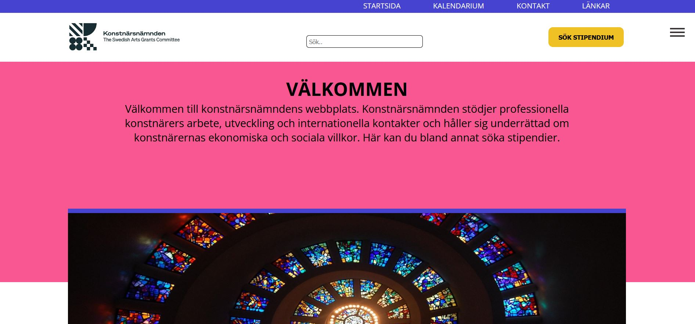

# Konstnärsnämnden - redesign

## The project

The first team project meant to redesign Konstnärsnämndens website using HTML5, CSS & Sass.

During the interviews at the start of this project we found that the users main pain points were that the original
page was difficult to navigate and there was too much information being displayed at once.

The design we created was made with the intention of simplifying the navigation, gathering the most important and
interesting links in one place and minimizing the amount of text displayed at once on every page.

